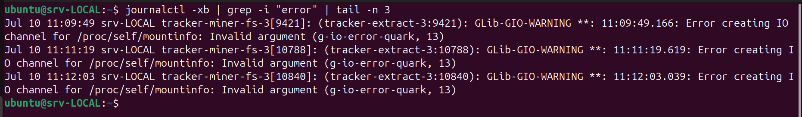
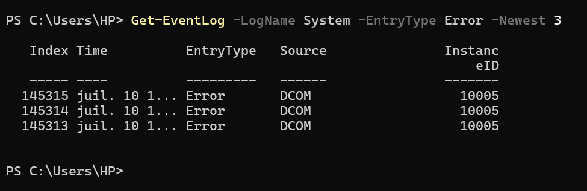
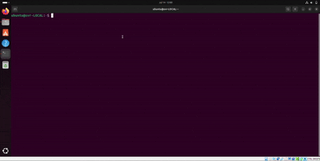

## Analyse de logs

**Description synthétique :**
Ce projet permet d'analyser des fichiers de logs pour extraire des statistiques et visualiser les données importantes.

**Image Ubuntu (paysage) :**

**Image Windows (paysage) :**

**GIF démonstration Ubuntu (<5 s) :**

**GIF démonstration Windows (<5 s) :**

**Lien GitHub :**
[À renseigner](https://github.com/)

**Technologies utilisées :**
- Bash (Shell script)
- PowerShell
- Outils de visualisation d'images et GIF
